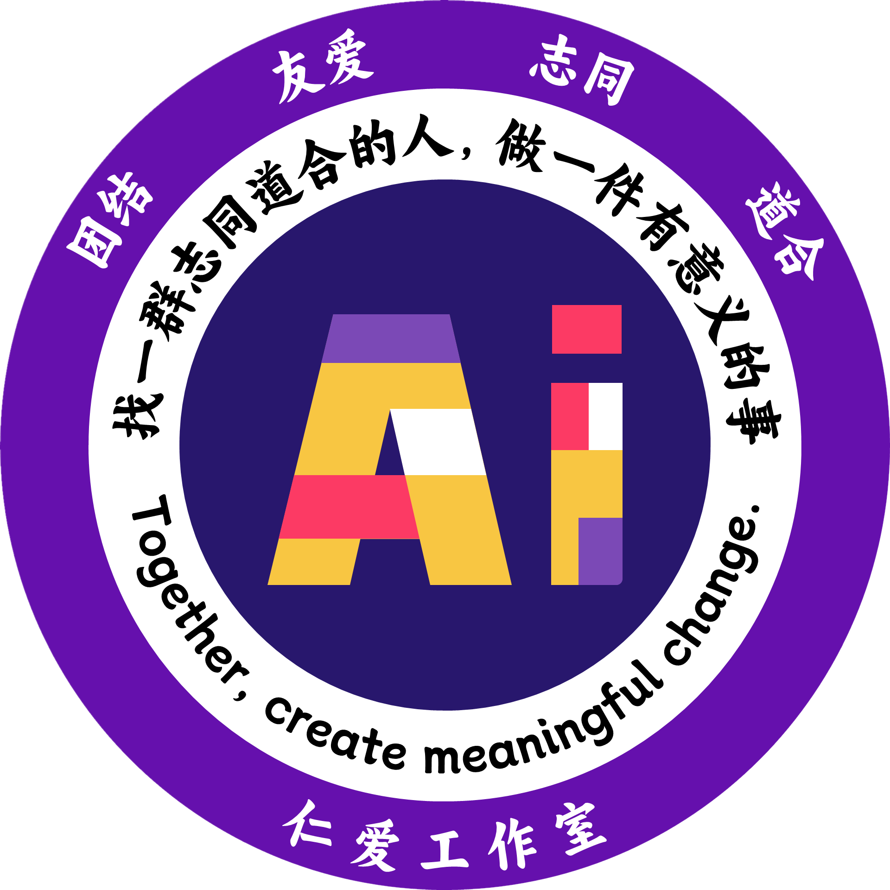

<h1 align="left">RENAIGO</h1>

<h2 align="center">仁爱社团编程导航</h2>

## ✍️ 项目介绍

访问地址：

[http://renaigo.cn/](http://renaigo.cn/)

[http://bloggo.chat/](http://bloggo.chat/)

## 🎉 创建目的

写知识管理文档的目的是为了有效记录和整理团队或个人的知识资产，提高工作效率，促进团队协作，并为决策和创新提
供支持。

通过文档化和共享知识，可以减少信息遗漏，加速问题解决，和提升组织的整体能力。

## ✨ 文档特点

目前网上大部分知识总结都比较散乱，没有良好的体系结构，不能很好的把握整体，本项目目前主要分成下面这大个部分，后面我也会更加细分，添加更多的内容。

为了方便大家在手机上阅读，我也提供了在线文档，方便大家随时查看。

## ⚡ 反馈与交流

在查阅过程中有任何问题和想法，可以进群讨论解决问题。

此网站正处于维护期，但不影响正常使用。有问题可以咨询作者：xxhyti@163.com

## 🎖 快速开始

::: info
选择合适的时间，不妨喝一杯咖啡，看一看相关的知识笔记。
 
 
仁爱工作室地址：15教计算机与软件学院15教大学生科技园A区仁爱工作室。
 
联系邮箱：xxhyti@163.com
:::

## ❤️ 致谢

感谢 [vuepress-theme-reco](https://vuepress-theme-reco.recoluan.com/) 。

